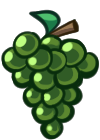
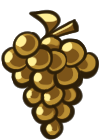

# Trabajo Práctico Final

  

¡Ayuda al pajarito a recolectar uvas y a llegar a su nido a salvo! 

Esquiva enemigos, recolecta frutas y dispara semillas hasta que el tiempo acabe.

  
  
  

Juega a Fly Home aquí: https://sashaflory.github.io/TPFinal-FlyHome/ 

Drive con GDD y TDD --> https://drive.google.com/drive/folders/11di7wfGo3mne-I9XBBN1rCN-vWAFKdJq?usp=drive_link 

